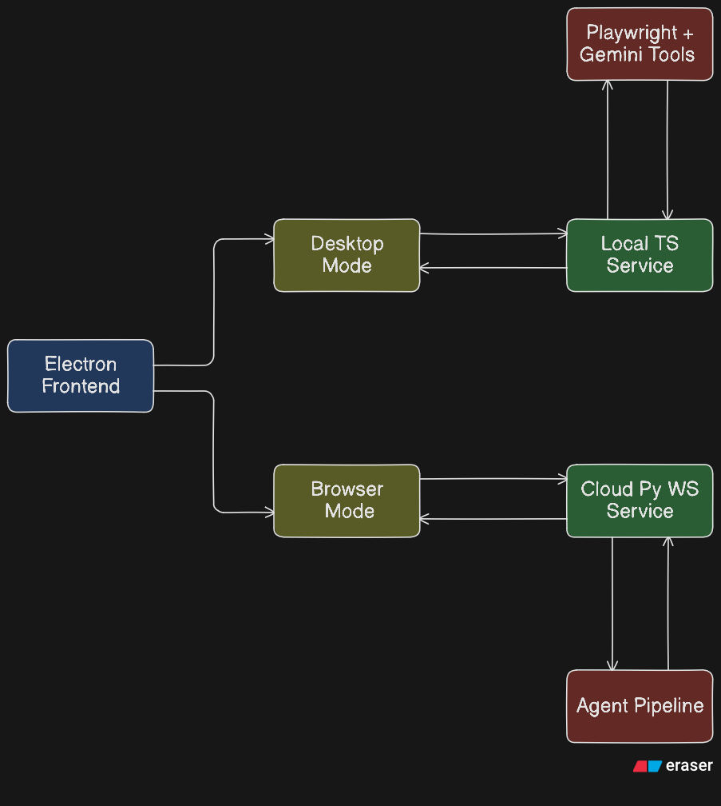

# TaskPilot

**Hybrid desktop + browser AI automation powered by Gemini and a multi-layer agent pipeline.**

Run autonomous tasks locally on your desktop or in a cloud browser session, with real-time screenshots, action traces, and safety-confirmed execution.

Built for the **Gemini Live Agent Challenge** hackathon. #GeminiLiveAgentChallenge

---

## Features

- **Dual Execution Modes** — Desktop mode (local native control) and Browser mode (cloud WebSocket + Playwright)
- **Layered Agent Pipeline** — Browser Layer, Action Router, Smart Interaction, A11y Reasoner, and Vision Computer Use fallback
- **Real-Time Control UI** — Electron dashboard with live screenshots, action stream, and model/mode switching
- **Provider-Agnostic AI Stack** — Gemini, Anthropic, OpenAI-compatible providers, Ollama/local model paths
- **Safety-Gated Automation** — Confirmation flow for risky actions, blocked and confirm pattern rules
- **Cross-Platform Foundations** — Windows/macOS desktop automation scripts plus browser-first fallback
- **Cloud-Deployable Browser Agent** — Python WebSocket server deployable on Cloud Run
- **Infrastructure as Code** — Terraform for Cloud Run, Artifact Registry, and required GCP APIs

---

## Architecture



---

## Tech Stack

| Category | Technologies |
|----------|--------------|
| **Desktop Agent Core** | Node.js, TypeScript, Express |
| **Desktop Control** | @nut-tree-fork/nut-js, Accessibility bridge (PowerShell/JXA), CDP |
| **Browser Automation** | Playwright (TS + Python), Browserbase |
| **AI/ML** | Gemini (`@google/genai`, `google-genai`), multi-provider abstraction |
| **Frontend** | Electron, vanilla JS, HTML/CSS |
| **Backend (Cloud)** | Python WebSocket server, Pydantic |
| **Cloud Services** | Google Cloud Run, Artifact Registry, Vertex AI mode |
| **Infrastructure** | Terraform |
| **Testing** | Vitest, Supertest, Pytest |
| **Deployment** | Dockerfile + Terraform + scripted automation (`deploy.sh`) |

---

## Getting Started

### Prerequisites

- Node.js 20+
- Python 3.11+
- npm
- Playwright browser dependencies
- Google Cloud project (for cloud/browser deployment)

### Installation

```bash
# Clone repository
git clone https://github.com/yourusername/taskpilot.git
cd taskpilot

# Install TypeScript desktop agent deps
cd clawd-cursor
npm install

# Install Electron frontend deps
cd ../frontend
npm install

# Install Python browser agent deps
cd ../computer-use-preview
pip install -r requirements.txt
```

### Environment Variables

| Variable | Required | Description |
|----------|----------|-------------|
| `GEMINI_API_KEY` | Yes (recommended) | Gemini key for model calls |
| `AI_API_KEY` | Optional | Generic provider key for clawd-cursor |
| `USE_VERTEXAI` | Optional | Enable Vertex AI mode (`true`/`false`) |
| `VERTEXAI_PROJECT` | Optional | GCP project ID for Vertex AI |
| `VERTEXAI_LOCATION` | Optional | Vertex AI location (often `global`) |
| `PLAYWRIGHT_HEADLESS` | Optional | Headless mode for cloud runtime |
| `BROWSERBASE_API_KEY` | Optional | Required for Browserbase provider |
| `GCP_PROJECT_ID` | Optional | Used by deployment script |
| `GCP_REGION` | Optional | Cloud Run region (default `us-central1`) |

### Development

```bash
# 1) Start clawd-cursor local API
cd clawd-cursor
npm run build
node dist/index.js start --port 3847

# 2) Start Electron frontend
cd ../frontend
npm start

# 3) (Optional) Start Python WebSocket server for browser mode
cd ../computer-use-preview
python server.py
```

### Production Build

```bash
# Build desktop agent
cd clawd-cursor
npm run build

# Build Electron app (Windows portable)
cd ../frontend
npm run build

# Automated cloud deployment (Docker + Terraform, no GitHub Actions)
cd ..
./deploy.sh --project <your-gcp-project>

```

---

## How It Works

### Agent Pipeline (Layered Execution)

1. **Task Intake** — Electron UI captures user prompt and selected mode/model
2. **Decomposition** — Local parser and/or LLM decomposition produces structured sub-steps
3. **Low-Cost Execution First** — Browser Layer + Action Router attempt deterministic actions before expensive vision loops
4. **Smart Escalation** — Smart Interaction and then Vision Computer Use handle ambiguous/complex steps
5. **Safety + Completion** — Confirmation gates risky actions; status, logs, and screenshots stream back to UI

### Desktop Mode

- Frontend sends tasks to local REST API (`127.0.0.1:3847`)
- clawd-cursor controls desktop/browser through native and accessibility channels
- UI polls status and renders live screenshots and step logs

### Browser Mode

- Frontend connects to Python WebSocket service
- Python BrowserAgent runs Gemini Computer Use loops over Playwright/Browserbase
- Iterative actions + frame updates are streamed to Electron in real time

---

## Project Structure

```text
taskpilot/
├── clawd-cursor/
│   ├── src/
│   │   ├── index.ts              # CLI entrypoint (start/doctor/stop)
│   │   ├── server.ts             # REST API + dashboard endpoints
│   │   ├── agent.ts              # Main orchestration pipeline
│   │   ├── browser-layer.ts      # Layer 0 browser-first execution
│   │   ├── safety.ts             # Safety classification + confirmations
│   │   ├── smart-interaction.ts  # Layer 1.5 planner/executor
│   │   ├── computer-use.ts       # Vision computer-use loop
│   │   └── ...
│   ├── scripts/                  # Windows/macOS accessibility helpers
│   ├── tests/                    # Vitest suite
│   └── package.json
├── computer-use-preview/
│   ├── server.py                 # WebSocket server + session manager
│   ├── agent.py                  # Gemini computer-use loop
│   ├── computers/                # Playwright/Browserbase backends
│   ├── memory.py                 # Session memory/persistence logic
│   └── requirements.txt
├── frontend/
│   ├── main.js                   # Electron main process
│   ├── renderer.js               # UI logic + transport handling
│   ├── index.html
│   ├── styles.css
│   └── package.json
├── terraform/
│   ├── main.tf                   # Cloud Run + Artifact Registry IaC
│   ├── variables.tf
│   ├── outputs.tf
│   └── README.md
├── deploy.sh                     # Automated Docker + Terraform cloud deployment
└── README.md
```

---

## Modes

| Mode | Description | Best For |
|------|-------------|----------|
| **Desktop Mode** | Local REST-driven automation with native desktop control | App switching, OS-level actions, local workflows |
| **Browser Mode** | Cloud/local WebSocket browser automation using Gemini computer-use | Web tasks, remote execution, scalable browser sessions |

---

## Automated Cloud Deployment Proof

This repository includes end-to-end deployment automation in code:

- **Docker image build** from `computer-use-preview/Dockerfile`
- **Artifact Registry + Cloud Run provisioning** with Terraform in `terraform/`
- **One-command scripted deployment** via `./deploy.sh`

Run:

```bash
./deploy.sh --project <your-gcp-project>
```

This satisfies the requirement to prove automated cloud deployment using scripts/IaC in a public repository, without GitHub Actions.

---
---

## License

MIT License - see `./LICENSE` for details.

---
